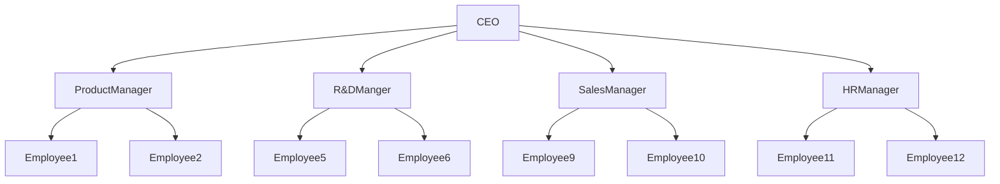
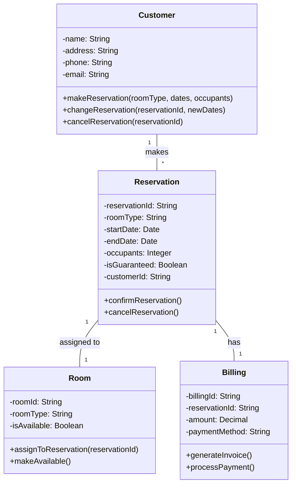
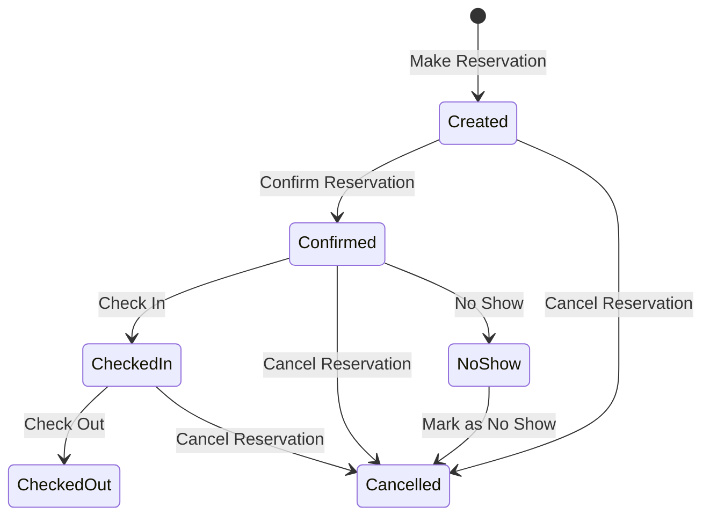
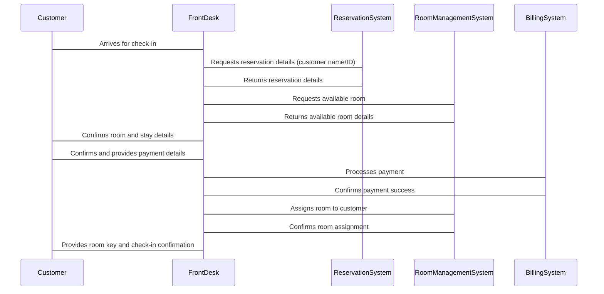
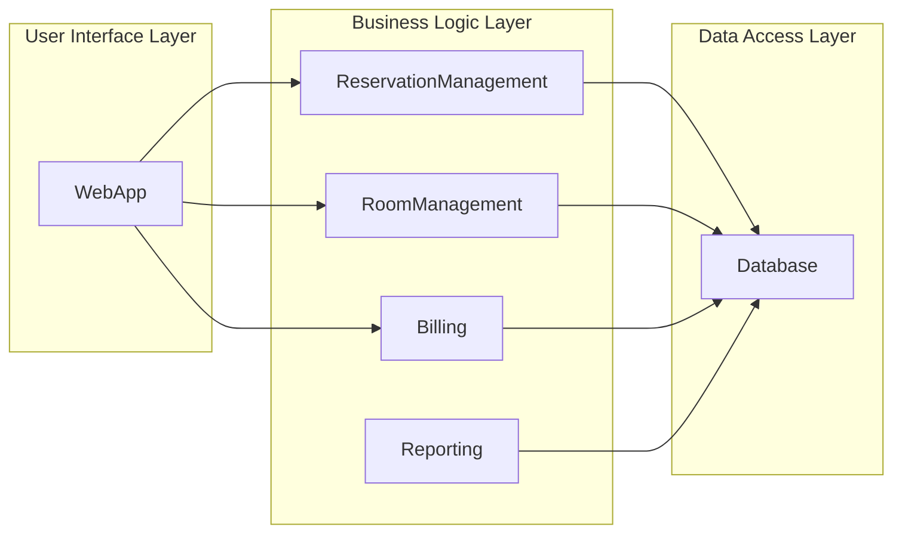
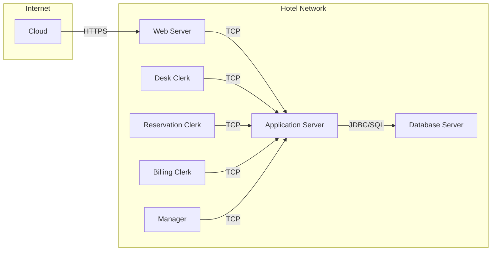

# Transactions

A transaction is a logical unit which is independently executed for data retrieval or CRUD. 

## Properties of Transaction

### Atomicity

A transaction must be fully completed, saved (committed) or completely undone (rolled back). 

> [!example]
> a sale scenario, the sale consists of inventory reduction and a record of incoming cash. Both either happen together or do not happen. It’s all or nothing.

### Consistency

Any given database transaction must change affected data only in allowed ways. Any data written to the database must be valid according to all defined rules, including constraints, cascades, triggers.  
  
Database consistency is important because it regulates the data that is coming in and rejects the data that doesn’t fit into the rules.  
  
>[!example]
>int type column can store integer values in (-2^31 to 2^31) because int is signed 32-bit integer. So, transaction which will try to manipulate int type column must has value in this integer region. If transaction has 2^35 value, transaction will be rolled back because of consistency problem of column and database.

### Isolation

Transaction data must not be available to other transactions until the original transaction is committed or rolled back.

> [!example]
> while one transaction(T1) is trying to withdraw money from account in bank system, the another transaction(T2) could not deposit money to same account. T2 must wait to be performed untill T1 committed or rolled back.

### Durability

Transactions that have been committed will survive permanently. For clear  understanding;

1. Firstly, DB engine marks the transaction committed.
2. Then permanently stores this transaction data in DB
3. Then sends the confirmation to user

What if DB crashes after step 1? While startup, DB engine can read that transaction was committed in logs but this transaction data is not written the DB block. So it will complete this transaction.

Many DBMSs implement durability by writing transactions into a transaction log. Transaction logs is used for reprocessing to recreate the system state right before any later failure. **A transaction is marked as committed only after it is entered in the log.**

## Transaction States

- **Active** - the initial state; The transaction stays in this state while it is executing.
	- Action include **reads** & **write** of the database objects
	- Notation :
		- Transaction T reading object O: $R_T$(O)
		- Transaction T writing object O: $W_T$(O)
- **Partially Commited** - after the final statement has been executed.
- **Failed** - after the discovery that normal execution can no longer proceed.
- **Aborted** - after the transaction has been rolled back and the database restored to its state prior to the start of the transaction.
	- Notation :
		- Aborting transaction T: $\text{Abort}_T$ 

Two options after it has been aborted:

- Restart the transaction 
	- can be done only if no internal logical error 
- Kill the transaction

- **Commited** - after successful completion.
	- Notation :
		- Commiting transaction T: $\text{Commit}_T$

![[Pasted image 20240520194351.png]]

# Schedule

A sequences of instructions that specify the chronological order in which instructions of concurrent transactions are executed.
- A schedule for a set of transactions must consist of all instructions of those transactions.
- Must preserve the order in which the instructions appear in each individual transaction.

A transaction that successfully completes its execution will have a commit instructions as the last statement.
- By default transaction assumed to execute commit instruction as its last step

A transaction that fails to successfully complete its execution will have an abort instruction as the last statement.

> [!example]
> Let $T_1$ transfer \$50 from A to B, and $T_2$ transfer 10% of the balance from A to B.

- A serial schedule in which $T_1$ is followed by $T_2$ :

![[Pasted image 20240520200301.png]]

- A serial schedule where $T_2$ is followed by $T_1$:

![[Pasted image 20240520200407.png]]

# Concurrency Control

DBMS interleaves actions of different transactions to improve performance.

Motivation for concurrent transactions
- CPU can process one transaction while another is waiting for a page to be read from disk
- Interleaving short transactions with longer transactions allows to complete quicker

# Scheduling Transactions

## Serial Schedule

Schedule that does not interleave the actions of different transactions.

## Equivalent Schedules

For any database state, the effect (on the set of objects in the database) of executing the first schedule is identical to the effect of executing the second schedule.

## Serializable Schedule

If a non-serial schedule and a serial schedule result in the same then the non-serial schedule is called a serializable schedule.

# Serializability

Basic Assumption – Each transaction preserves database consistency. Thus serial execution of a set of transactions preserves database consistency.

A (possibly concurrent) schedule is serializable if it is equivalent to a serial schedule. Different forms of schedule equivalence give rise to the notions of: 
1. Conflict serializability 
2. View serializability

# Conflicting Instructions

Instructions $l_i$ and $l_j$ of transactions $T_i$ and $T_j$ respectively, conflict if and only if there exists some item Q accessed by both $l_i$ and $l_j$, and at least one of these instructions wrote Q.

- $l_i$ = read(Q), $l_j$ = read(Q) $l_i$ and $l_j$ don’t conflict.
- $l_i$ = read(Q), $l_j$ = write(Q). They conflict.
- $l_i$ = write(Q), $l_j$ = read(Q). They conflict
- $l_i$ = write(Q), $l_j$ = write(Q). They conflict

Intuitively, a conflict between li and lj forces a (logical) temporal order between them.
- If $l_i$ and $l_j$ are consecutive in a schedule and they do not conflict, their results would remain the same even if they had been interchanged in the schedule.

# Conflict Serializability

If a schedule $S$ can be transformed into a schedule $S´$ by a series of swaps of non-conflicting instructions, we say that $S$ and $S´$ are conflict equivalent.

We say that a schedule $S$ is conflict serializable if it is conflict equivalent to a serial schedule.

